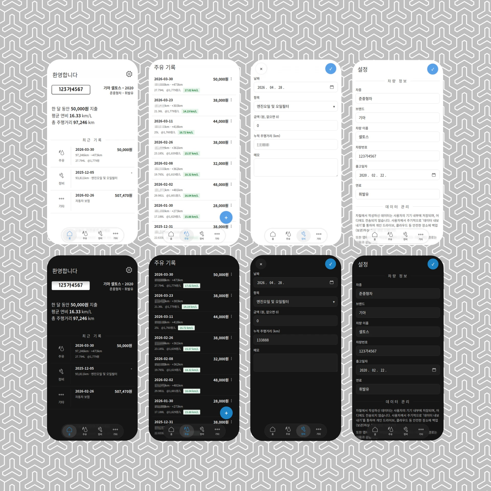

## 개요
국내에 서비스 되고 있는 주요 차계부 서비스를 대체함으로써, '차계부'에 필요한 가장 핵심 기능만을 지원하는 경량화 앱을 목표로 하고 있습니다.
# [> 차필 데모버전 열기 <](http://chapil-demo.varmakoro.net/)

## 스크린샷


## 기술 스택
- Backend: FastAPI (Python) Rest API
- Database: SQLite
- Frontend: React
- Infra: Docker, Docker Compose, Tailscale VPN
- License: LGPL

## 디렉토리 구조
```
chapil/
├── app/                              # Python 백엔드
├── frontend/                      # React 프론트엔드
├── data/carlog.db              # SQLite DB (자동 생성)
├── Dockerfile
└── docker-compose.yml
```

# 사용 방법
## [ 계획 중 ] 애플 앱스토어, 구글 플레이를 통한 설치
현재 이를 위한 준비 단계에 있습니다.

## Docker와 VPN을 활용한 셀프호스팅
저는 이 앱을 집에 있는 NAS에 설치된 Docker를 통해 배포하여 사용하고 있습니다. 사용자가 직접 설치하여 사용할 것을 염두에 둔 것으로, 아직 로그인 기능을 구현하지 않았습니다. 장기적으로는 지원할 계획을 갖고 있습니다. 지금은 각자 사용하시는 NAS를 비롯한 홈서버, 웹호스팅(AWS 등) 등으로 직접 구동하셔야 합니다.

### 1. 파일 업로드
File Station에서 적당한 위치에 `chapil` 폴더 통째로 업로드.  
예: `/volume1/docker/chapil`

### 2. 서비스 시작
```bash
cd /volume1/docker/chapil
docker compose up --build -d
```

### 4. 접속
모바일 앱 특성상 어디서든 접속해야 사용이 가능하므로, 안전을 위해 공유기 포트포워딩은 하지 마시고 VPN을 이용하실 것을 권장드립니다.
테스트 된 VPN 환경은 Tailscale입니다.

Tailscale IP로 접속:  
`http://100.x.x.x:8000`

스마트폰 브라우저에서 접속 후 '홈 화면에 추가' 하면 앱처럼 사용 가능.

## 업데이트
코드 수정 후:
```bash
docker compose down
docker compose up -d --build
```

## 데이터 백업
- `/data`에 있는 `carlog.db`는 앱 실행에 필요한 데이터 원본입니다.
- `/backups` 경로 안에 .json 형식의 백업 파일이 자동으로 저장됩니다. 이는 앱 실행마다 진행되며, 24시간 이내에 최대 1회까지 진행됩니다. 최대 30개까지 저장되며, 이를 넘어가면 오래된 파일 순서대로 자동 삭제됩니다.

# 업데이트 기록
### v26.4.28a
- UI가 대폭 개선되었습니다.
- 설정 페이지가 추가되었습니다.
- 데이터 가져오기 및 내보내기 기능의 구현이 완료되었습니다.
- 데이터 자동 백업 기능이 구현되었습니다. 1일 1회 진행되며, 실행 시마다 백그라운드에서 작동합니다.
### v26.4.25a
- [백엔드] 데이터 마이그레이션(내보내기 및 가져오기)을 위한 기초 작업이 진행되었습니다.
- [프론트엔드] 차량 설정 페이지의 뼈대가 구축되었습니다.
### v26.4.4a
- 일부 오류를 바로잡았습니다.
### v26.4.3a
- [백엔드] jinja2 템플릿 기반 MPA에서 FastAPI REST API로 전환하였습니다.
- [프론트엔드]html/css/js에서 React 기반으로 대체되었습니다.
- [최적화] react-router-dom을 활용하여 SPA(Single Page Application) 방식으로 구동하도록 개선하였습니다.
### v26.4.2a
- UI를 개편하였습니다.
- 홈 탭의 맨 위에 '🚗차계부' 문구를 '요약'으로 대체하였습니다.
- 입력 항목에서 저장 및 취소 버튼을 상단에 항상 고정되도록 변경하였습니다.
- 그 밖에 시각 효과가 추가되었습니다.
### v26.4.1a
- 아이콘을 추가하였습니다.
- iOS 외에 안드로이드에서 웹앱 형식으로 사용이 되지 않던 문제를 해결하였습니다.
### v26.3.30a
- UI를 일부 개선하였습니다.
- 이미 등록한 주유 기록을 수정할 때 주유단가, 주유비, 주유량 셋 중 하나라도 값이 바뀌면 나머지 두 값을 자동으로 다시 계산합니다.
- 주유 기록을 새로 등록할 때 주유단가, 주유비, 주유량 셋 중 두 가지만 기록하고 나머지 한 곳을 빈칸으로 남기면 이를 자동으로 계산해 줍니다. 예를 들어, 주유단가와 주유비만 입력하면 이에 기반하여 주유량을 알아서 계산해 줍니다.
- 이미 등록한 주유 기록을 도중에 수정했을 때 연비 계산을 다시 하지 않는 문제를 바로잡았습니다.
- 주유, 정비, 기타 기록을 수정하려 할 때, 기존에 메모 칸을 비워뒀을 경우 'None'이라는 내용이 채워지는 버그가 있었습니다. 이를 해결하였습니다.
### v26.3.24a
- 최초 버전

# 장기적인 계획
- 애플 앱스토어 및 구글 플레이 등록을 계획하고 있습니다.

# 이전 버전 스크린샷
### v26.4.2a


### v26.4.1a


### v26.3.30a
