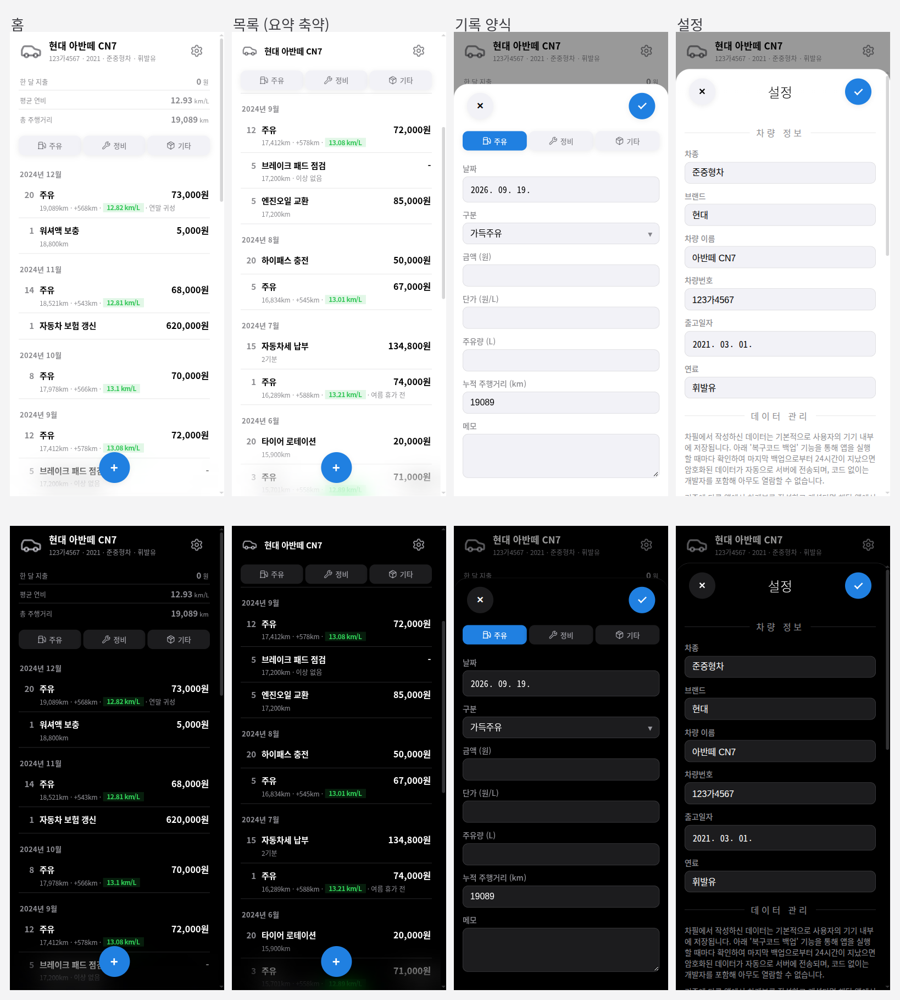
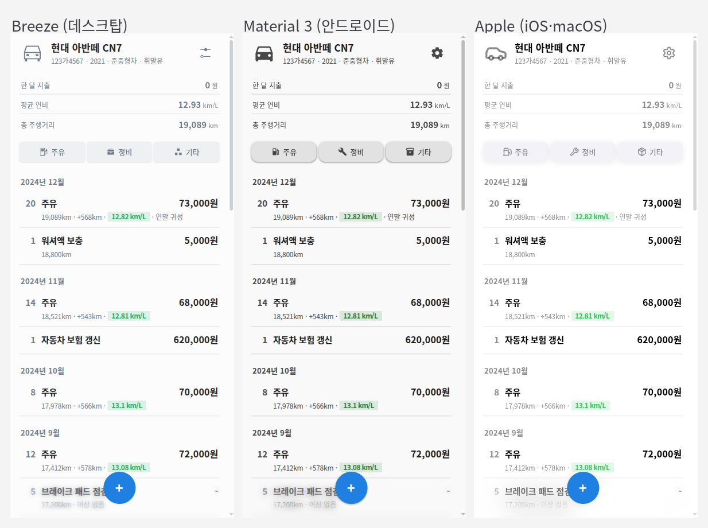
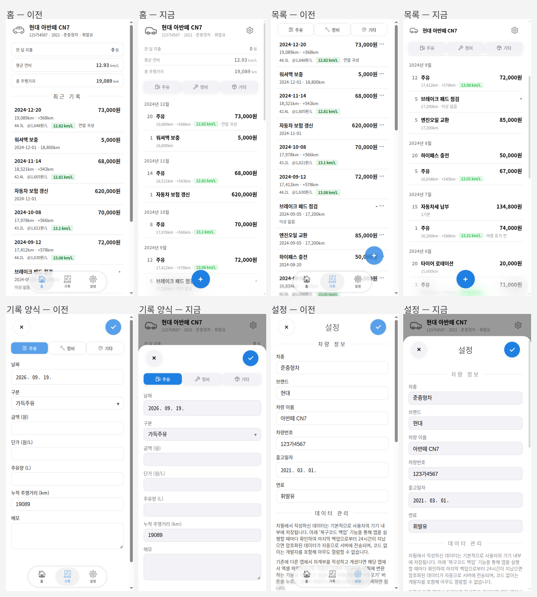
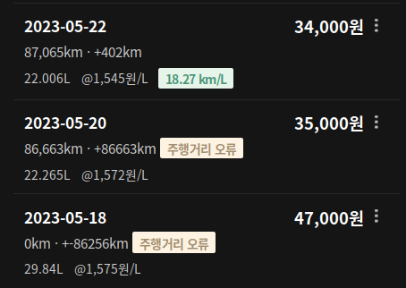
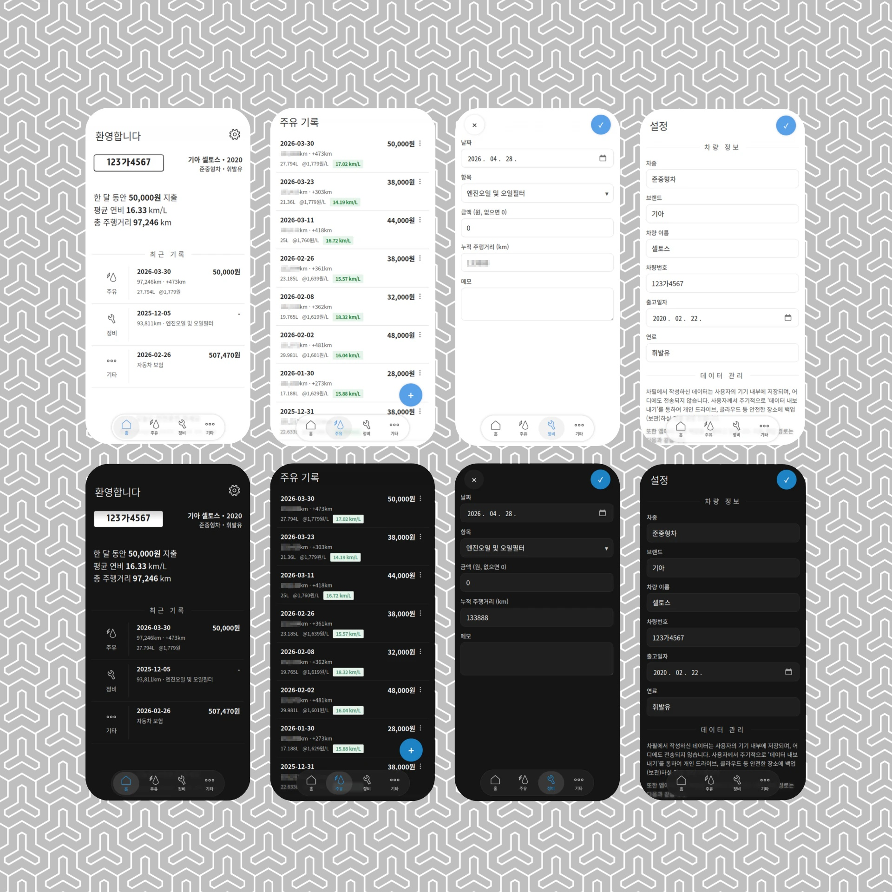
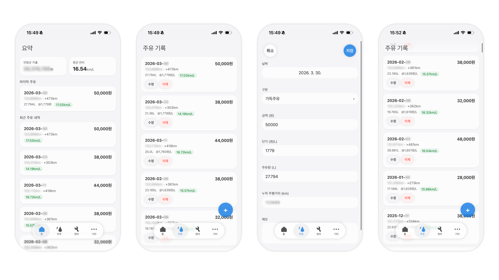
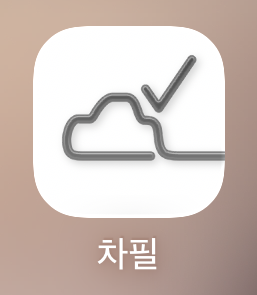
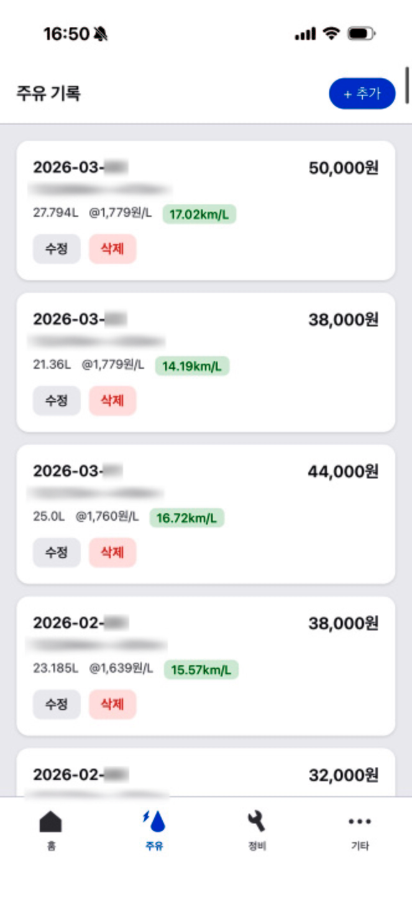

## 개요
실속있는 차주님들을 위한 차량 특화형 가계부 앱, '차필'입니다.
국내에 서비스 되고 있는 주요 차계부 서비스를 대체함으로써, '차계부'에 필요한 가장 핵심 기능만을 지원하는 경량화 앱을 목표로 하고 있습니다.
# [> 차필 데모버전 <](http://chapil-demo.varmakoro.net/)

## 스크린샷


### OS에 맞춰 테마가 바뀝니다
접속한 기기를 보고 테마를 입힙니다. 색·모서리·그림자·블러는 물론 아이콘까지 함께 바뀌며, 레이아웃은 한 가지로 고정입니다.



### 이전 버전과 비교


## 기술 스택
- Architecture: 로컬 우선(local-first) — 기록은 기기 내 SQLite에 저장
- Database: SQLite WASM (OPFS) — 클라이언트 측 데이터 저장소
- Backend: FastAPI (Python) — 복구코드 백업 / 피드백 / 데모 시드 / SPA 서빙
- Frontend: React + Vite (SPA)
- Native App: Capacitor (iOS / Android)
- Infra: Docker, Docker Compose, Tailscale VPN, Codemagic CI/CD
- Theme: OS 판별 후 Material 3 / Apple / KDE Breeze 토큰 세트를 적용 (`docs/tokens/`에서 3종 비교 가능)
- License: LGPL — UI 아이콘은 테마별로 [Material Design Icons](https://github.com/google/material-design-icons)(Apache-2.0), [KDE Breeze](https://invent.kde.org/frameworks/breeze-icons)(LGPL-3.0+), [Lucide](https://github.com/lucide-icons/lucide)(ISC)를 씁니다. 출처별 고지는 `frontend/src/assets/symbols/NOTICE.md`

## 디렉터리 구조
```
chapil/
├── app/                      # Python 백엔드 (FastAPI) — 보조 역할
│   ├── main.py               # 복구코드/피드백/데모 시드 API, SPA 서빙
│   ├── database.py           # 백업 메타데이터 저장소
│   ├── feedback.py           # 피드백 수집
│   └── seed_demo.json        # 데모 초기 데이터
├── frontend/                 # React 프론트엔드 (Vite) — 데이터의 본체
│   ├── src/
│   │   ├── db.js             # SQLite WASM(OPFS) 초기화 및 스키마
│   │   ├── pages/            # 페이지 컴포넌트
│   │   ├── components/       # 공용 컴포넌트 (Sheet.jsx = 팝업 껍데기)
│   │   ├── context/          # React Context
│   │   ├── hooks/            # 커스텀 훅
│   │   ├── assets/symbols/   # 테마별 아이콘 (material/ breeze/ apple/ + NOTICE.md)
│   │   ├── App.jsx           # 라우팅 (배경 위에 시트를 겹치는 분기 포함)
│   │   ├── theme.js          # OS 판별 → data-theme. ?theme= 로 수동 지정 가능
│   │   ├── sheet.js          # 시트로 띄울지 판정 + 닫기(useClose)
│   │   ├── recordsRevision.js # 기록이 바뀌면 배경 목록·요약을 다시 읽게 하는 신호
│   │   ├── api.js            # 백엔드 API 호출 (백업/피드백)
│   │   └── index.css         # 전역 스타일 + 디자인 토큰 6블록
│   ├── scripts/
│   │   └── build-icons.py    # 세 출처의 SVG를 currentColor 심볼로 정규화
│   └── public/               # PWA manifest, 아이콘
├── docs/
│   ├── tokens/index.html     # 디자인 토큰 참조 페이지 (index.css를 읽어 테마 3종 비교)
│   ├── client/               # 개편 기획·설계 문서
│   └── showcase/             # 스크린샷과 목업
├── android/                  # Capacitor Android 프로젝트
├── ios/                      # Capacitor iOS 프로젝트
├── assets/                   # 앱 아이콘 및 스플래시 이미지 원본
├── capacitor.config.json     # Capacitor 설정
├── codemagic.yaml            # 앱스토어 빌드 CI/CD 설정
├── Dockerfile
├── docker-compose.yml
└── data/carlog.db            # SQLite DB (자동 생성)
```

# 사용 방법
## [ 모집 중 ] 구글 플레이 비공개 테스터
차필은 현재 구글 플레이 비공개 테스트 단계에 있습니다. 정식 출시를 위해서는 14일 동안 테스터 12명이 필요하며, 함께해 주실 분을 찾고 있습니다.

1. [테스터 그룹에 가입](https://groups.google.com/g/chapil-testers) — 승인 절차 없이 바로 가입됩니다.
2. [테스트 참여하기](https://play.google.com/apps/testing/com.iranto.chapil) — 가입에 사용한 구글 계정으로 접속해 참여 버튼을 눌러 주세요. **이 단계를 건너뛰면 테스터로 집계되지 않습니다.**
3. 안내에 따라 플레이스토어에서 차필을 설치합니다.

설치 후 14일 동안은 그룹 탈퇴나 테스트 참여 취소를 하지 말아 주세요. 그 기간이 지나면 언제든 나가셔도 됩니다. 사용 중 불편한 점은 앱 안의 '피드백 보내기'로 알려주시면 큰 도움이 됩니다.

## [ 준비 중 ] 애플 앱스토어를 통한 설치
Capacitor 기반의 네이티브 앱 빌드 환경이 구축되어 있으며, 앱스토어 출시를 준비 중입니다.

## Docker와 VPN을 활용한 셀프호스팅
저는 이 앱을 집에 있는 NAS에 설치된 Docker를 통해 배포하여 사용하고 있습니다. 장기적으로 안드로이드 및 iOS에서의 앱 출시를 목표로 하고 있으나, 지금은 각자 사용하시는 NAS를 비롯한 홈서버, 웹호스팅(AWS 등) 등으로 직접 구동하셔야 합니다.

### 1. 파일 업로드
File Station에서 적당한 위치에 `chapil` 폴더 통째로 업로드.  
예: `/volume1/docker/chapil`

### 2. 서비스 시작
```bash
cd /volume1/docker/chapil
docker compose up --build -d
```

### 4. 접속
모바일 앱 특성상 어디서든 접속해야 사용이 가능하므로, 안전을 위해 공유기 포트포워딩은 하지 마시고 개인 VPN을 이용하실 것을 권장드립니다.
테스트 된 VPN 환경은 Tailscale입니다.

Tailscale IP로 접속:  
`http://100.x.x.x:8000`

스마트폰 브라우저에서 접속 후 '홈 화면에 추가' 하면 앱처럼 사용 가능.

##### 업데이트
코드 수정 후:
```bash
docker compose down
docker compose up -d --build
```

##### 데이터 백업 (복구코드)
- 모든 차량 기록은 기본적으로 사용자 기기 안에만 저장됩니다.
- 앱을 처음 실행하면 로그인 없이 64자리 복구코드가 자동으로 발급됩니다. 이 코드로부터 파생된 키로 데이터를 기기에서 직접 암호화한 뒤, 앱을 실행할 때마다 확인하여 마지막 백업으로부터 24시간이 지났으면 서버에 전송해 보관합니다. 서버는 암호문만 가지고 있을 뿐 원본 코드나 복호화 키를 알 수 없어, 관리자를 포함해 코드 없이는 아무도 내용을 열람할 수 없습니다.
- 복구코드는 설정 화면의 '복구코드 백업' 섹션에서 언제든 다시 확인·복사할 수 있으며, 보존 기간(무기한/1년/6개월 미접속 시 자동 삭제)도 직접 정할 수 있습니다. 기기를 잃어버리거나 앱을 새로 설치했다면 같은 코드를 입력해 데이터를 복원하세요.

---

# 장기 계획
- 구글 플레이는 비공개 테스트 중이며, 테스터 요건을 채우는 대로 정식 출시할 예정입니다.
- 애플 앱스토어 출시도 준비하고 있습니다.

# 업데이트 내역
### v26.9.20
##### 화면 구성 개편
- 홈과 기록 페이지를 하나로 합쳤습니다. 요약은 맨 위에 고정되고, 스크롤하면 줄어들면서 차량 이름과 필터만 남습니다.
- 하단 탭 바를 없앴습니다. 그 자리에는 '기록 추가' 버튼 하나만 가운데에 뜹니다.
- 기록 목록을 월 단위로 묶고 행 높이를 일정하게 맞췄습니다. 각 행 오른쪽의 '⋯' 메뉴는 없앴으며, 삭제는 수정 화면 아래로 옮겼습니다.
##### 팝업으로 열리는 기록 양식과 설정
- 기록 양식과 설정이 전체 페이지 대신 팝업으로 뜹니다. 모바일에서는 아래에서 올라오고, 데스크탑에서는 화면 한가운데에 뜹니다. 뒤 화면은 그대로 남아 있어 어디에서 눌렀는지 잊지 않습니다.
- 팝업에서 기록을 추가·수정·삭제하면 뒤에 있는 목록과 요약이 곧바로 따라 바뀝니다.
- 주소를 직접 입력하거나 북마크로 들어오면 예전처럼 전체 페이지로 열립니다. 팝업을 지원하지 않는 옛 브라우저도 같은 경로로 떨어지므로 못 쓰는 화면은 없습니다.
##### OS별 테마
- 접속한 기기를 보고 테마를 입힙니다. 안드로이드는 Material 3, iPhone·iPad·Mac은 Apple, 그 밖의 데스크탑은 KDE Breeze입니다. 색·모서리·그림자·블러가 함께 바뀌며 레이아웃은 한 가지로 고정입니다.
- 아이콘도 테마를 따라갑니다. 테마마다 출처가 다르며(Material Design Icons / KDE Breeze / Lucide), Breeze에 없는 주유·충전 아이콘은 같은 문법으로 직접 그렸습니다.
- 주소 끝에 `?theme=apple`처럼 붙이면 테마를 직접 골라볼 수 있습니다. `?theme=auto`로 되돌립니다.
##### 그 밖에
- 다크 모드에서 선택 목록·날짜 선택기 같은 브라우저 기본 위젯이 밝은 색으로 남던 문제를 고쳤습니다. 다크 모드용 파비콘도 연결했습니다.
- 스크롤바를 얇고 반투명하게 다듬었습니다.
- 쓰이지 않으면서 빌드마다 1.6MB씩 포함되던 폰트를 뺐고, 홈 요약이 화면에 쓰지도 않는 기록 10건을 매번 조회하던 것을 없앴습니다.
### v26.8.6
##### 피드백 기능 복구
- 피드백 전송이 외부 서비스(Nextcloud Forms)에 의존하던 것을 자체 구현으로 교체했습니다. 그동안 해당 서비스 중단으로 피드백이 전송되지 않던 문제가 해결되었습니다.
- 피드백은 앱 버전·기기 정보·오류 위치와 함께 항목별로 정리되어 저장됩니다. 수집 항목은 이전과 동일합니다.
##### 정리
- 실제로 사용하지 않던 Redis 컨테이너와 의존성을 제거했습니다.
- 앱 버전 표기가 화면·피드백·앱 패키지에서 서로 달랐던 문제를 바로잡고 한 곳에서 관리하도록 했습니다.
### v26.7.17b
##### 복구코드 백업
- 로그인 없이 코드 하나로 백업/복원하는 '복구코드' 시스템이 추가되었습니다. 앱을 처음 실행하면 코드가 자동으로 발급되며, 기기에서 AES-GCM으로 암호화된 데이터가 주기적으로 자체 호스팅 서버에 저장됩니다. 서버는 암호화된 내용만 가지고 있어 개발자를 포함해 아무도 열람할 수 없습니다.
- 설정 화면에서 코드를 다시 확인·복사하거나, 보존 기간(무기한/1년/6개월)을 정하거나, 다른 코드로 복원할 수 있습니다. 코드는 기본적으로 화면에 흐리게(blur) 표시되며 '보이기'를 눌러야 보입니다.
##### 백엔드 정리
- 프론트엔드가 더 이상 호출하지 않던 서버 측 CRUD·가져오기/내보내기·이미지 업로드 코드를 전부 제거했습니다(1157줄 → 약 90줄). 실제 데이터 처리는 전부 클라이언트(sqlite-wasm)에서 이루어지며, 서버는 정적 파일 서빙과 복구코드 저장만 담당합니다.
- 이에 따라 기존의 '/backups 폴더 자동 백업' 방식은 복구코드 시스템으로 대체되었습니다.
### v26.7.8b
- CSS 디자인 토큰 체계를 시맨틱 네이밍으로 전면 재편하였습니다. (`--bg` → `--surface`, `--primary` → `--accent`, `--text` → `--on-surface` 등 20여 개)
- 디자인 토큰 인터랙티브 참조 페이지(`docs/tokens/`)를 추가하였습니다. 각 토큰의 라이트/다크 값, 실제 컴포넌트 예시, Do/Don't 가이드를 확인할 수 있습니다.
### v26.6.1b
- 일부 버그가 수정되었습니다
### v26.5.22b
- 구글 플레이스토어 및 애플 앱스토어 출시를 위한 컴포넌트 변경 등 준비 작업
### v26.5.3a
##### 차계부 옮기기
- 데이터 가져오기 기능이 더욱 간편해졌습니다. 이제 기존에 사용하던 차계부 앱에서 저장한 엑셀 파일(xlsx) 하나만 준비하세요.
- 현재는 '마이클' 앱에 대해서만 지원됩니다.
##### 차량 프로필 사진
- 이제 차량의 프로필 사진을 차계부에 등록해 보세요. 마치 SNS에 프로필 사진 올리는 것과 똑같이 작동합니다.


##### 오류 수정
- 주유 기록을 할 때에 계기판 주행거리를 입력하지 않으면 다음 주유기록 시 계산 오류를 일으키는 점이 발견되어 수정하였습니다.



### v26.4.28a
- UI가 대폭 개선되었습니다.
- 설정 페이지가 추가되었습니다.
- 데이터 가져오기 및 내보내기 기능의 구현이 완료되었습니다.
- 데이터 자동 백업 기능이 구현되었습니다. 1일 1회 진행되며, 실행 시마다 백그라운드에서 작동합니다.
### v26.4.25a
- [백엔드] 데이터 마이그레이션(내보내기 및 가져오기)을 위한 기초 작업이 진행되었습니다.
- [프론트엔드] 차량 설정 페이지의 뼈대가 구축되었습니다.
### v26.4.4a
- 일부 오류를 바로잡았습니다.
### v26.4.3a
- [백엔드] jinja2 템플릿 기반 MPA에서 FastAPI REST API로 전환하였습니다.
- [프론트엔드]html/css/js에서 React 기반으로 대체되었습니다.
- [최적화] react-router-dom을 활용하여 SPA(Single Page Application) 방식으로 구동하도록 개선하였습니다.
### v26.4.2a
- UI를 개편하였습니다.
- 홈 탭의 맨 위에 '🚗차계부' 문구를 '요약'으로 대체하였습니다.
- 입력 항목에서 저장 및 취소 버튼을 상단에 항상 고정되도록 변경하였습니다.
- 그 밖에 시각 효과가 추가되었습니다.
### v26.4.1a
- 아이콘을 추가하였습니다.
- iOS 외에 안드로이드에서 웹앱 형식으로 사용이 되지 않던 문제를 해결하였습니다.
### v26.3.30a
- UI를 일부 개선하였습니다.
- 이미 등록한 주유 기록을 수정할 때 주유단가, 주유비, 주유량 셋 중 하나라도 값이 바뀌면 나머지 두 값을 자동으로 다시 계산합니다.
- 주유 기록을 새로 등록할 때 주유단가, 주유비, 주유량 셋 중 두 가지만 기록하고 나머지 한 곳을 빈칸으로 남기면 이를 자동으로 계산해 줍니다. 예를 들어, 주유단가와 주유비만 입력하면 이에 기반하여 주유량을 알아서 계산해 줍니다.
- 이미 등록한 주유 기록을 도중에 수정했을 때 연비 계산을 다시 하지 않는 문제를 바로잡았습니다.
- 주유, 정비, 기타 기록을 수정하려 할 때, 기존에 메모 칸을 비워뒀을 경우 'None'이라는 내용이 채워지는 버그가 있었습니다. 이를 해결하였습니다.
### v26.3.24a
- 최초 버전

# 이전 버전 스크린샷
### v26.4.28a


### v26.4.2a


### v26.4.1a


### v26.3.30a

